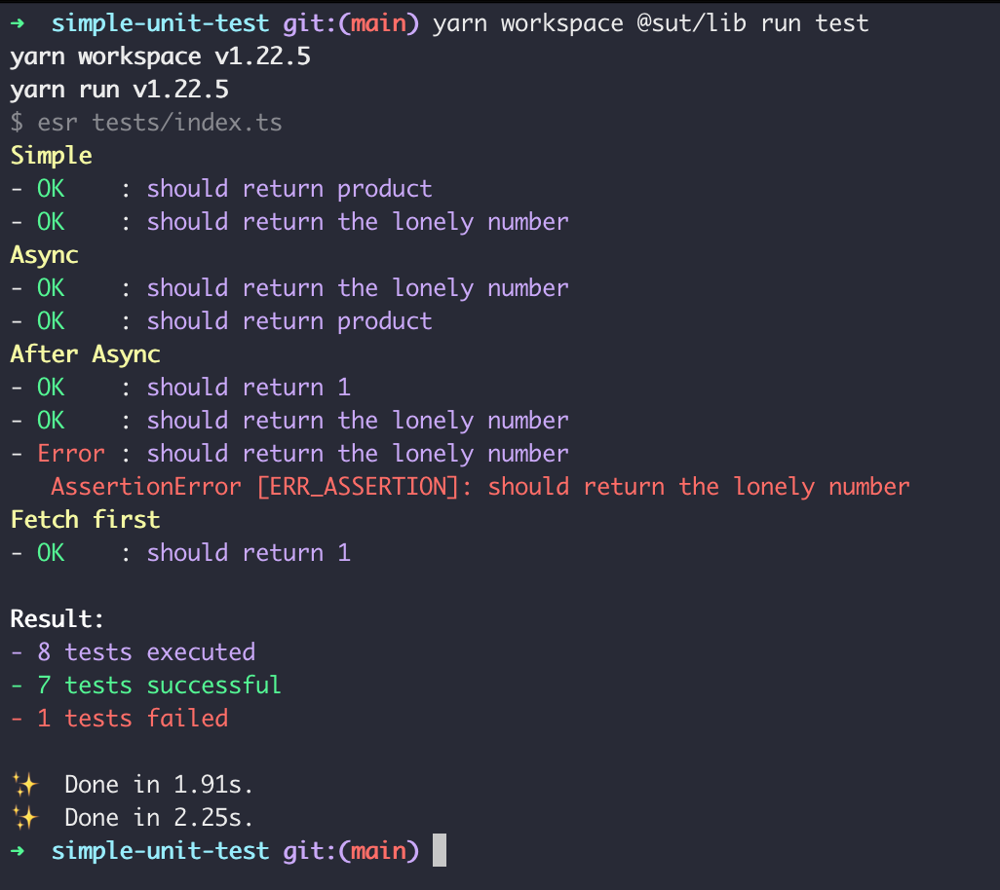

# Simple-unit-test (simut)

To make super simple unit test on typescript.

## Appendix

The idea was to make it as simple as possible to make some unit test in typescript or javascript. I was thinking of using this for simple things like experiments where you need basic test to go faster or iterview tests, exercises like advent of code, etc.

Tools like jest/tape are really complete and offer a lot but always require some setup (ts-node, babel, ...). I wanted something super easy to start with.

I usually use `assert` from node to do the tests but any testing library that throw on error should work.

To run the test i simple use `esbuild-runner` [repo](https://github.com/folke/esbuild-runner)

```bash
esr tests/index.ts
```


It's a one file test lib.
It's mostly a experiment and me trying to kill time while i'm looking for a job.
In the end i use esbuild-runner like tape use ts-node so it's not as nice as i wanted it to be.

**If you need production level testing, please use Jest, Mocha, Tape or your favorite battle tested test runner.**



## Installation

```bash
yarn add simut
```

#### Peer dependencies

```bash
yarn add -D esbuild esbuild-runner
```

## Usage/Examples

```typescript
import fetch from 'node-fetch'
import { strict as assert } from 'assert'

import { test, run, group } from '../src'
import { lonelyNumber } from '../src/example'

group('Simple')

test('should return product', async () => assert.equal(lonelyNumber(1, 2, 3), 6, 'should return the product'))
test('should return the lonely number', async () => assert.equal(lonelyNumber(1, 1, 3), 3, 'should return the lonely number'))

group('Async')

test('should return the lonely number', async () =>
	new Promise((r, re) => {
		setTimeout(() => {
			try {
				assert.equal(lonelyNumber(1, 1, 4), 4, 'should return the lonely number')
				r()
			} catch (e) {
				re(e)
			}
		}, 1000)
	}))
test('should return product', async () => assert.equal(lonelyNumber(1, 2, 3), 6, 'should return the product'))

group('After Async')

test('should return 1', async () => assert.equal(lonelyNumber(3, 3, 3), 1, 'should return 1'))
test('should return the lonely number', async () => assert.equal(lonelyNumber(3, 1, 3), 1, 'should return the lonely number'))
test('should return the lonely number', async () => assert.equal(lonelyNumber(3, 1, 3), 3, 'should return the lonely number'))

group('Fetch first')

test('should return 1', async () =>
	fetch('https://deckofcardsapi.com/api/deck/new/shuffle/?deck_count=1').then(() =>
		assert.equal(lonelyNumber(3, 3, 3), 1, 'should return 1')
	))

run()
```

## API Reference

#### test

```typescript
test('test name', async () => 'assertion returning a promise or throwing or error')
```

| Parameter | Type       | Description                                                           |
| :-------- | :--------- | :-------------------------------------------------------------------- |
| `title`   | `string`   | **Required**. Description of the test                                 |
| `fn`      | `function` | **Required**. function throwing of test error and returning a promise |

Create a new test

#### group

```typescript
group('Group title')
```

| Parameter | Type     | Description                     |
| :-------- | :------- | :------------------------------ |
| `title`   | `string` | **Required**. Name of you group |

Create a group

#### run

```typescript
run()
```

Run the tests and print the output in terminal

## License

[MIT](https://choosealicense.com/licenses/mit/)
